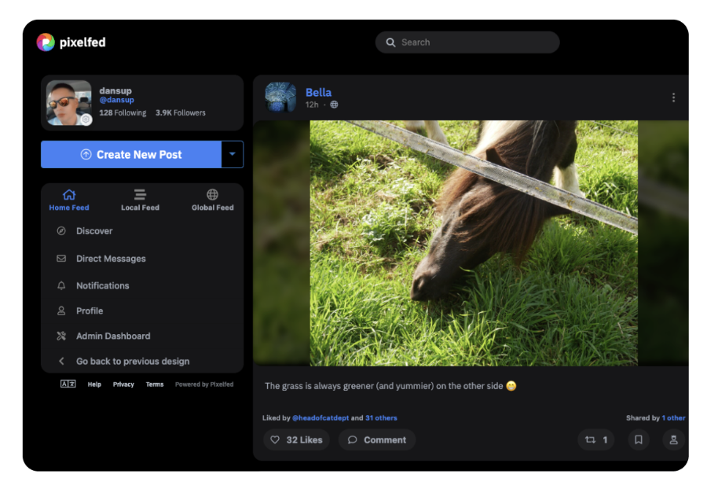

<!--
Ohart ongi: README hau automatikoki sortu da <https://github.com/YunoHost/apps/tree/master/tools/readme_generator>ri esker
EZ editatu eskuz.
-->

# Pixelfed YunoHost-erako

[](https://ci-apps.yunohost.org/ci/apps/pixelfed/)


[](https://install-app.yunohost.org/?app=pixelfed)

*[Irakurri README hau beste hizkuntzatan.](./ALL_README.md)*

> *Pakete honek Pixelfed YunoHost zerbitzari batean azkar eta zailtasunik gabe instalatzea ahalbidetzen dizu.*  
> *YunoHost ez baduzu, kontsultatu [gida](https://yunohost.org/install) nola instalatu ikasteko.*

## Aurreikuspena

PixelFed is a decentralized and federated image sharing software under development.
In addition to taking over the functionality of Instagram, the functioning of PixelFed is:

* Decentralized: Each instance can follow one or more other PixelFed instances in order to allow their respective members to interact. A first pixelfed.social public body limited to 10,000 members has already been created.

* Federated: Via the ActivityPub protocol, PixelFed can interact with other software that is part of the Fediverse, such as Mastodon or PeerTube for example.

It is possible to import your data from Instagram.


**Paketatutako bertsioa:** 0.12.5~ynh1

## Pantaila-argazkiak



## Dokumentazioa eta baliabideak

- Aplikazioaren webgune ofiziala: <https://pixelfed.org/>
- Erabiltzaileen dokumentazio ofiziala: <https://docs.pixelfed.org/>
- Administratzaileen dokumentazio ofiziala: <https://docs.pixelfed.org/running-pixelfed/administration.html>
- Jatorrizko aplikazioaren kode-gordailua: <https://github.com/pixelfed/pixelfed>
- YunoHost Denda: <https://apps.yunohost.org/app/pixelfed>
- Eman errore baten berri: <https://github.com/YunoHost-Apps/pixelfed_ynh/issues>

## Garatzaileentzako informazioa

Bidali `pull request`a [`testing` abarrera](https://github.com/YunoHost-Apps/pixelfed_ynh/tree/testing).

`testing` abarra probatzeko, honakoa egin:

```bash
sudo yunohost app install https://github.com/YunoHost-Apps/pixelfed_ynh/tree/testing --debug
edo
sudo yunohost app upgrade pixelfed -u https://github.com/YunoHost-Apps/pixelfed_ynh/tree/testing --debug
```

**Informazio gehiago aplikazioaren paketatzeari buruz:** <https://yunohost.org/packaging_apps>
