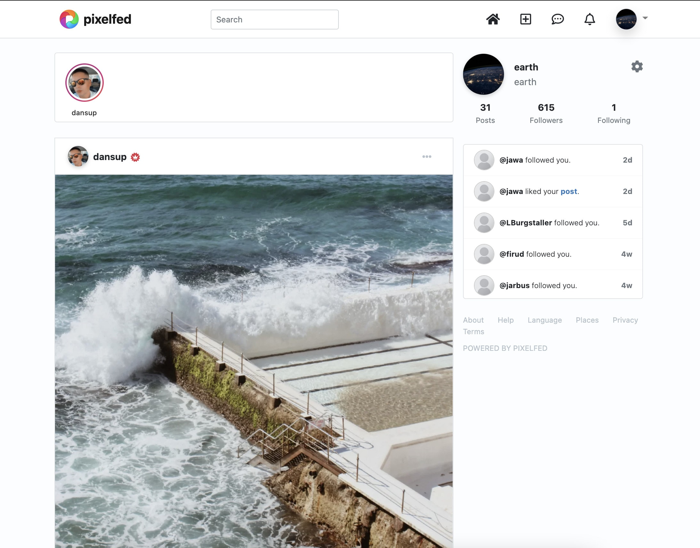

<!--
Nota bene : ce README est automatiquement généré par <https://github.com/YunoHost/apps/tree/master/tools/readme_generator>
Il NE doit PAS être modifié à la main.
-->

# Pixelfed pour YunoHost

[](https://dash.yunohost.org/appci/app/pixelfed)  

[](https://install-app.yunohost.org/?app=pixelfed)

*[Lire le README dans d'autres langues.](./ALL_README.md)*

> *Ce package vous permet d’installer Pixelfed rapidement et simplement sur un serveur YunoHost.*  
> *Si vous n’avez pas YunoHost, consultez [ce guide](https://yunohost.org/install) pour savoir comment l’installer et en profiter.*

## Vue d’ensemble

PixelFed est un logiciel décentralisé et fédéré de partage d'images en cours de développement.
En plus de reprendre les fonctionnalités d'Instagram, le fonctionnement de PixelFed est:

* Décentralisé : Chaque instance peut suivre une ou plusieurs autres instances PixelFed afin de permettre à leurs membres respectifs d'interagir. Une première instance publique pixelfed.social limitée à 10 000 membres a déjà été créée.

* Fédéré : Via le protocole ActivityPub, PixelFed peut interagir avec d'autres logiciels qui font partie du Fediverse, comme Mastodon ou PeerTube par exemple.

Il est également possible d'importer ses données depuis Instagram.


**Version incluse :** 0.11.13~ynh1

## Captures d’écran



## Avertissements / informations importantes

## Some useful commands to know to manage your instance
You need to run them from you pixelfed folder (usually `/var/www/pixelfed`). The `php.VERSION` might be changed according to you current package version.

### Applying changes from the `.env` config file

Once you made some changes, you need to run `php8.2 artisan config:cache && php8.2 artisan cache:clear` to apply them.
Note: this will disconnect any logged-in account (including from the admin web UI).

### Removing avatar cache to save space
`php8.2 artisan avatar:storage-deep-clean`

Use it to prune old avatars that are outdated or no longer used. This might save some disk space.

### Fix missing avatars or refetch them.
`php8.2 artisan  avatar:storage`

It can be used to fetch remote avatars that are not loaded (or in case you deleted `/var/www/pixelfed/storage/app/public/cache/avatars` where they are stored).
It might also be usefull to migrate that cache (only, not the other existing media) to an S3 storage, by refectching all of them.

Be aware that this will generate a lot of "jobs" that will take time to be completed, and have a significant load on your server (especially bandwith and CPU).

### When using S3

- Delete non-used media that where not cleaned (it happens) : `php8.2 artisanmedia:gc` (Delete media uploads not attached to any active statuses)

- Same but for media stored on S3 storage and still locally stored (doubles) : `php8.2 artisan media:s3gc` (Delete (local) media uploads that exist on S3)

- Migrate your media to an S3 storage (you need to configure it first), so media uploaded before configuring S3 are migrated there: `php8.2 artisanmedia:migrate2cloud` (Move older media to cloud storage)

- Migrate from one S3 backend the other one (change the configuration first): `php8.2 artisanmedia:cloud-url-rewrite` (Rewrite S3 media urls from local users)

## Documentations et ressources

- Site officiel de l’app : <https://pixelfed.org/>
- Documentation officielle utilisateur : <https://docs.pixelfed.org/>
- Documentation officielle de l’admin : <https://docs.pixelfed.org/running-pixelfed/administration.html>
- Dépôt de code officiel de l’app : <https://github.com/pixelfed/pixelfed>
- YunoHost Store : <https://apps.yunohost.org/app/pixelfed>
- Signaler un bug : <https://github.com/YunoHost-Apps/pixelfed_ynh/issues>

## Informations pour les développeurs

Merci de faire vos pull request sur la [branche `testing`](https://github.com/YunoHost-Apps/pixelfed_ynh/tree/testing).

Pour essayer la branche `testing`, procédez comme suit :

```bash
sudo yunohost app install https://github.com/YunoHost-Apps/pixelfed_ynh/tree/testing --debug
ou
sudo yunohost app upgrade pixelfed -u https://github.com/YunoHost-Apps/pixelfed_ynh/tree/testing --debug
```

**Plus d’infos sur le packaging d’applications :** <https://yunohost.org/packaging_apps>
