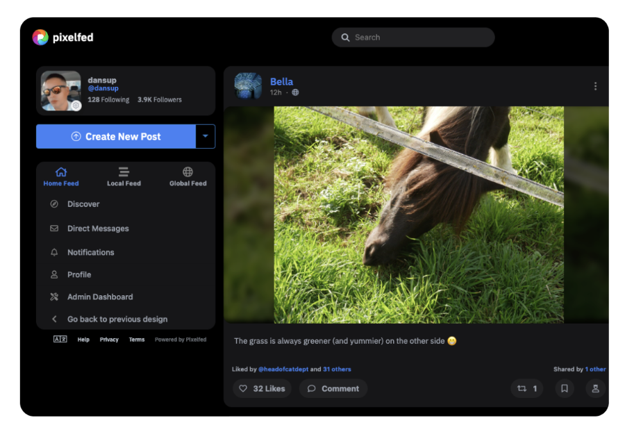

<!--
Важно: этот README был автоматически сгенерирован <https://github.com/YunoHost/apps/tree/master/tools/readme_generator>
Он НЕ ДОЛЖЕН редактироваться вручную.
-->

# Pixelfed для YunoHost

[](https://ci-apps.yunohost.org/ci/apps/pixelfed/)


[](https://install-app.yunohost.org/?app=pixelfed)

*[Прочтите этот README на других языках.](./ALL_README.md)*

> *Этот пакет позволяет Вам установить Pixelfed быстро и просто на YunoHost-сервер.*  
> *Если у Вас нет YunoHost, пожалуйста, посмотрите [инструкцию](https://yunohost.org/install), чтобы узнать, как установить его.*

## Обзор

PixelFed is a decentralized and federated image sharing software under development.
In addition to taking over the functionality of Instagram, the functioning of PixelFed is:

* Decentralized: Each instance can follow one or more other PixelFed instances in order to allow their respective members to interact. A first pixelfed.social public body limited to 10,000 members has already been created.

* Federated: Via the ActivityPub protocol, PixelFed can interact with other software that is part of the Fediverse, such as Mastodon or PeerTube for example.

It is possible to import your data from Instagram.


**Поставляемая версия:** 0.12.5~ynh1

## Снимки экрана



## Документация и ресурсы

- Официальный веб-сайт приложения: <https://pixelfed.org/>
- Официальная документация пользователя: <https://docs.pixelfed.org/>
- Официальная документация администратора: <https://docs.pixelfed.org/running-pixelfed/administration.html>
- Репозиторий кода главной ветки приложения: <https://github.com/pixelfed/pixelfed>
- Магазин YunoHost: <https://apps.yunohost.org/app/pixelfed>
- Сообщите об ошибке: <https://github.com/YunoHost-Apps/pixelfed_ynh/issues>

## Информация для разработчиков

Пришлите Ваш запрос на слияние в [ветку `testing`](https://github.com/YunoHost-Apps/pixelfed_ynh/tree/testing).

Чтобы попробовать ветку `testing`, пожалуйста, сделайте что-то вроде этого:

```bash
sudo yunohost app install https://github.com/YunoHost-Apps/pixelfed_ynh/tree/testing --debug
или
sudo yunohost app upgrade pixelfed -u https://github.com/YunoHost-Apps/pixelfed_ynh/tree/testing --debug
```

**Больше информации о пакетировании приложений:** <https://yunohost.org/packaging_apps>
